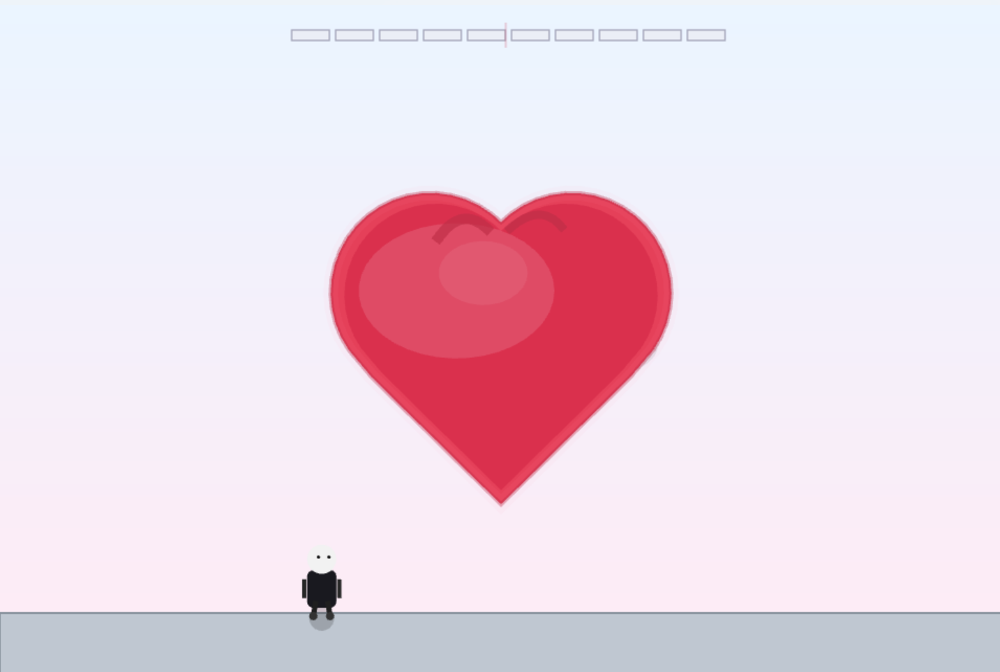
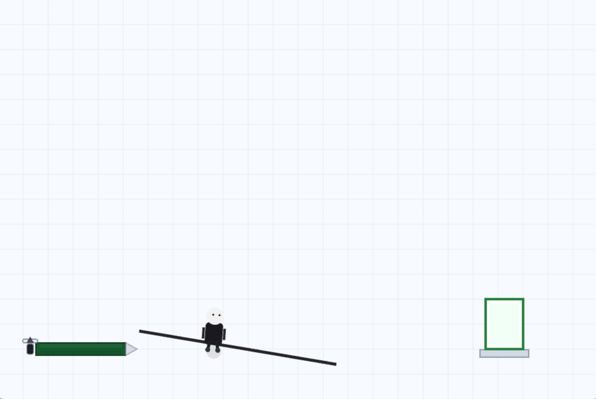
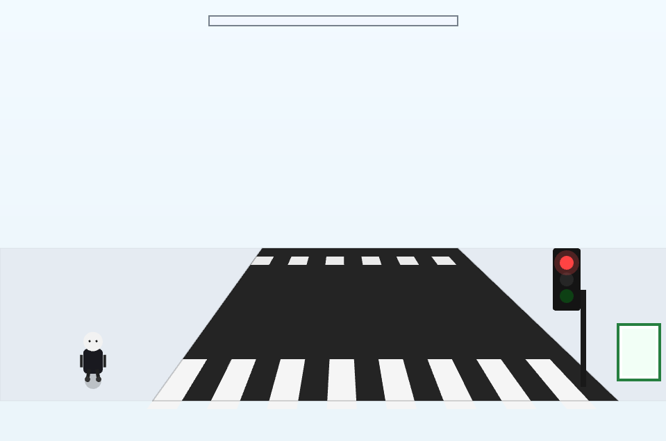
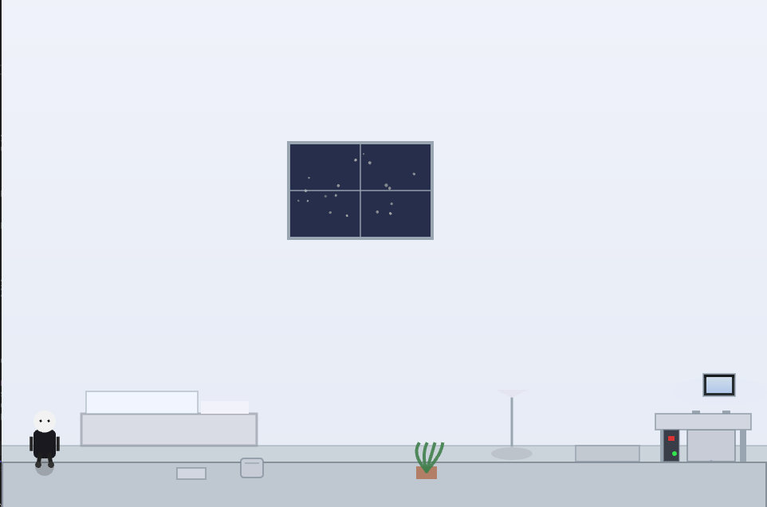

# Sin Land
>バンダイナムコスタジオ杯Siv3Dゲームジャムにエントリーした際の作品です

> OpenSiv3D で制作した2Dアクション謎解きゲームです

> [デモプレイ動画](https://youtu.be/EWKwl3qIvAY)
> Youtubeで再生されます

---

# ⚙️ インストール方法

## 🪟 Windows

### ZIPをダウンロードする場合
[⬇️ SinLand_Windows.zip をダウンロード](https://github.com/haitooo/SinLand/raw/main/SinLand_Windows.zip)
1. ZIPファイルを解凍してください。
2. 解凍されたフォルダに入っているSinLand.exeを実行してください。
3. もしSinLand.exeを移動したい場合は、SinLand.exeと同じディレクトリ内にAssetsフォルダを一緒に配置してください。音声などが正常に再生されなくなります。

### git cloneする場合 
1. このリポジトリをクローンしてください。
   ```bash
   git clone https://github.com/haitooo/SinLand.git
2. クローンしたリポジトリからSinLand.exeを実行してください。
3. もしSinLand.exeを移動したい場合は、SinLand.exeと同じディレクトリ内にAssetsフォルダを一緒に配置してください。音声などが正常に再生されなくなります。

## 🍎🐧 Apple・Linux
1. [公式サイト](https://siv3d.github.io/ja-jp/) から **OpenSiv3D (v0.6 以降)** をインストール
2. Main.cppをこのリポジトリのMain.cppに差し替えてください。
3. ビルドして実行ファイルを作成してください。
4. 実行ファイルと同じディレクトリ内にAssetsフォルダを一緒に配置してください。音声などが正常に再生されなくなります。
5. 実行ファイルを実行でプレイできます。
   
---

# 🎮 ゲーム概要

プレイヤーはアプリ開発中、突然謎の島に…部屋に戻ることはできるのか
各ステージはそれぞれ独立したテーマとギミックを持ち、プレイヤーの直感と観察力が試される

## 🕹 操作方法

| 操作 | 内容 |
|------|------|
| ← / → または **A / D** | 左右移動 |
| ↑ または **W / Space** | ジャンプ |
| **Esc** | タイトルに戻る（タイトル画面でEsc→アプリを終了） |

---

## 🌆 ステージ解説とこだわりポイント

各ステージの詳細な解説ページへジャンプできます。

| ステージ名 | テーマ | 解説リンク |
|-------------|---------|-------------|
| Stage 1 | **森林** | [解説を見る](#stage-1-森林) |
| Stage 2 | **心臓** | [解説を見る](#stage-2-心臓) |
| Stage 3 | **シャー芯** | [解説を見る](#stage-3-シャー芯) |
| Stage 4 | **信号** | [解説を見る](#stage-4-信号) |
| Stage 5 | **真珠** | [解説を見る](#stage-5-真珠) |
| Stage 6 | **分身** | [解説を見る](#stage-6-分身) |

---

## 🔍 各ステージ解説

### Stage 1 森林  

> サルがヒントを出すNPCとして登場

> 左からサルが提示した順番にフルーツを並び替えるとクリアとなる

> 木の下には二つのスイッチが設置されていて踏むとそれぞれ違うルールでフルーツの順番が入れ替わる

> ＜工夫点＞
> フルーツの初期配置はランダムな配置にしている

---

### Stage 2 心臓

> 心臓の鼓動に合わせてジャンプをするとゲージがたまる

> 連続成功でクリア
> 意外とシビア

> ＜工夫点＞
> 音声を使ったギミック
> アニメーションと音と成功判定のタイミングを合わせる点に苦労した


---

### Stage 3 シャー芯

> シャーペンの芯を伸ばして足場にしていく

> 伸ばしすぎると折れるよ
> 勢いよく乗ると折れるよ
> シャー芯だから

> ＜工夫点＞
> 芯が折れるかの判定に重力加速度の要素をいれた

---

### Stage 4 信号  

> 赤信号を渡ると車に轢かれます。危ないですね。

> ステージには隠されたセンサーがあり、一定時間そこで待機すると青信号になる
> 感知式信号をイメージして設計した

> ＜工夫点＞
> 遠近感のあるアニメーション描画

---

### Stage 12(Last Stage)  寝室

> 部屋にたどり着いたプレイヤーは何をするのだろうか…

### Stage 5 真珠(実装中)
> スロットを止めて鍵とドアを揃える。  

---

### Stage 6 分身（実装中）
> 忍者が近づくと四人に分身。  
> ヒントは「ノイズ」「影」「間」など微細な違い。  
> 三回正解でクリア、ミスでやり直し

---
